# SSR Windows

## 下载与安装

[点击这里下载客户端](https://down.touhou.asia/ssr-download/ssr-win.7z)

1、将文件下载到非中文目录。

  

2、运行ShadowsocksR.exe（同时为了安全起见，请不要使用360、百度、2345等全家桶）

   

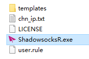

3、第一次运行可能需要允许通过防火墙，勾选全部网络，点击允许访问。

 

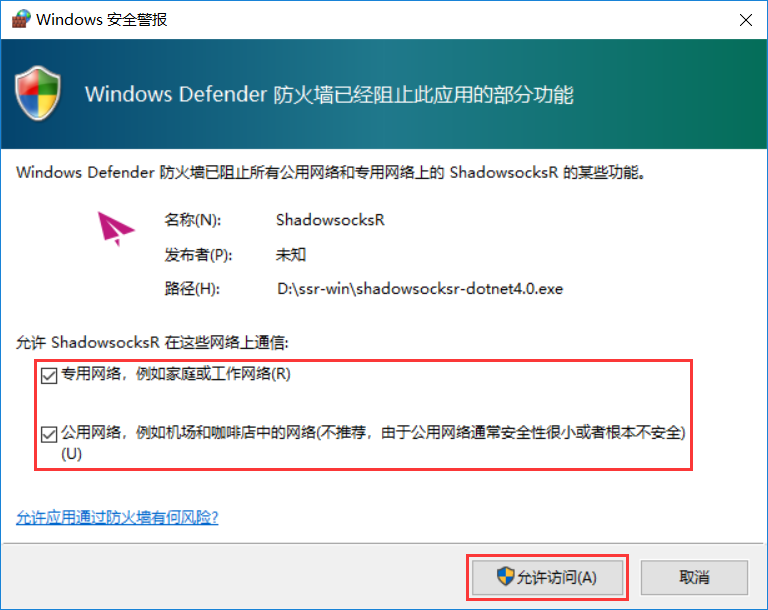

4、 **注意：** 客户端配置完成前，建议先使用直连模式，以免导致无法访问一些网站，配置完成后使用PAC模式或全局模式。  
右键小飞机→系统代理模式→直连模式

 

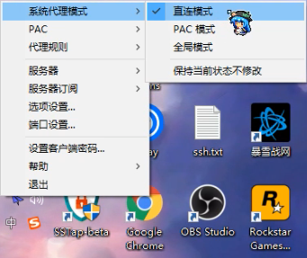

## 设置服务器订阅

1、右键右下角托盘处的白色小飞机图标→服务器订阅→SSR服务器订阅设置

 

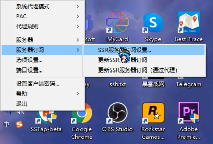

2、 先点击Add，再将订阅地址（点击 [这里](https://wiki.touhou.tw/wang-zhan-shi-yong/xuan-ze-jie-dian) 查看如何获取订阅地址）复制进“网址”栏，点击确定。  
**注意：** 一定要确保将订阅地址复制进“网址”栏，替换掉点击Add时自动产生的地址。

 

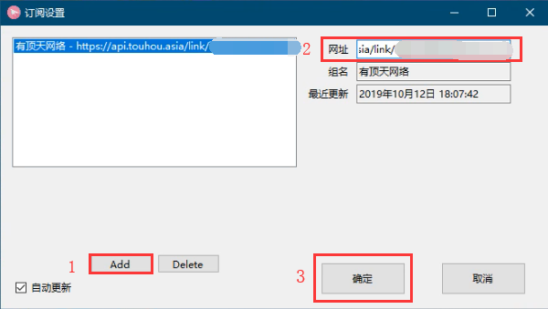

3、右键小飞机→服务器订阅→更新SSR服务器订阅

 

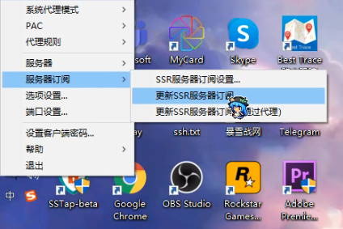

 

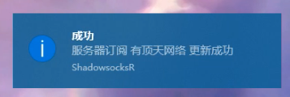

## 选择节点

 1、右键小飞机→服务器→有顶天网络，选择合适的节点（点击这里查看如何选择合适的节点）。

 

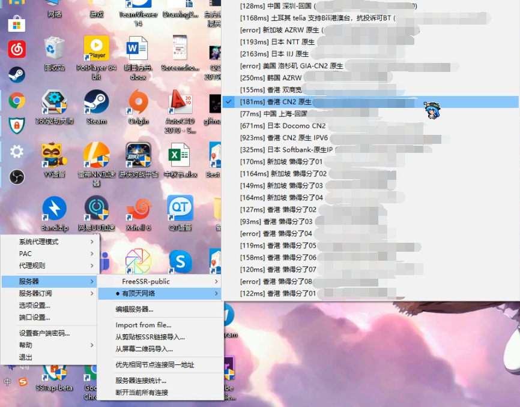

2、**有的客户端默认开启负载均衡，意思是将流量分配到不同的节点上，这将导致使用IP变动或速度低下。 为了使用指定的节点，防止遇到奇怪的问题，请关闭负载均衡。**

## 选择代理模式

以下代理模式选择其中一种 推荐设置：平时使用PAC模式，只代理被墙网站，当需要代理没有被墙的网站时切换成全局模式，使用完后切换回PAC模式。

* **PAC模式**

此模式只代理被墙网站

右键小飞机→系统代理模式→PAC模式

 

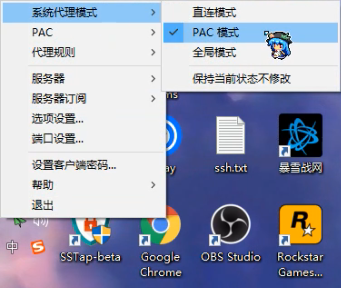

第一次使用需要更新PAC 右键小飞机→PAC→更新PAC为GFWList

 

如果你是海外用户，想要翻回国内，请选择更新PAC为仅通过大陆常见域名（国外访问大陆）。

 

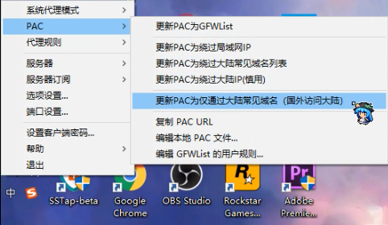

此时可以正常上网

 

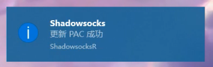

 

* **全局模式**

此模式代理所有国外网站  
如果使用此模式时遇到打开国内网站慢的情况，请使用PAC模式，并在需要时在两种模式间切换。

右键小飞机→系统代理模式→全局模式

 

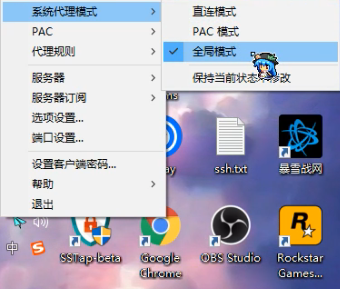

右键小飞机→代理规则→绕过局域网和大陆

 

如果你是海外用户，想要翻回国内，请选择绕过局域网和非大陆。

 

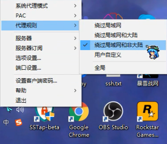

此时可以正常上网

 

## 使用SOCKS5代理 

软件运行时提供一个本地SOCKS5代理，地址为127.0.0.1，端口为1080。 如果你的软件支持SOCKS5代理，就可以设置使用。 以Telegram为例

 

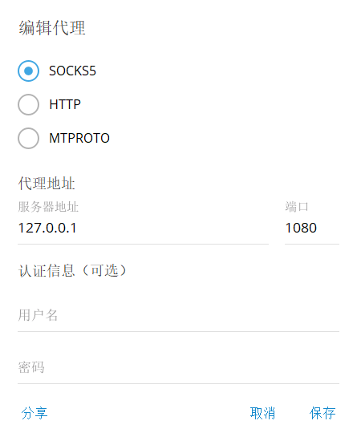

## 设置开机启动 

为了方便使用建议设置开机启动

右键小飞机→选项设置

 

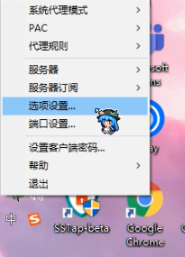

勾选开机启动，点击确定。

 

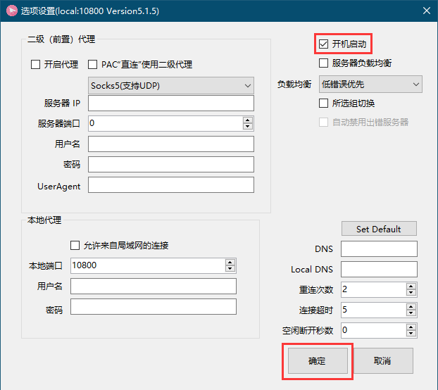

## 断开连接与退出 

右键小飞机→系统代理模式→直连模式

此时软件不再代理，效果与退出软件相同。

 

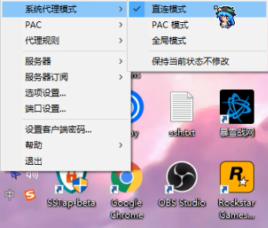

 右键小飞机→退出  
下次使用直接打开该软件，选择代理模式和节点即可。  
**注意：** 退出软件前需要先设置为直连模式

 

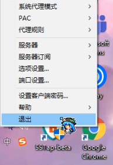

